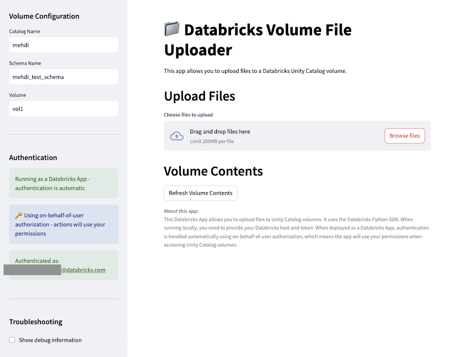

# Databricks Volume File Uploader

A Streamlit app that allows users to upload files to Unity Catalog volumes using on-behalf-of-user authorization.



## Features

- Upload files to Unity Catalog volumes
- Browse volume contents
- Uses on-behalf-of-user authorization to access volumes with user permissions

## Setup Instructions

### 2. Create an app

```bash
git clone https://github.com/Mmodarre/Databricks-Apps-Unity-Catalog-File-Uploader.git
cd src
databricks apps create
```

#### 2.1 Test locally using PAT Token

```bash
streamlit run app.py
```

### 1. Deploy the App

Deploy the app to your Databricks workspace:

```bash
databricks apps deploy
```

### 2. Configure OAuth Scopes

This document explains how to properly set up on-behalf-of-user authorization for Databricks Apps.

#### Overview

On-behalf-of-user authorization allows a Databricks App to access resources using the permissions of the logged-in user. This provides several benefits:

- Users can only access resources they have permission to
- Permissions are managed through standard Databricks/Unity Catalog mechanisms
- No need to grant broad permissions to the app's service principal

#### Important: Use Databricks CLI

OAuth scopes for on-behalf-of-user authorization must be configured using the Databricks CLI, not in the app.yaml file or the UI.

#### Required CLI Commands

#### Add account admin profile to CLI
0. Login to CLI as accont admin
```bash
auth login --account-id ccb842e7-2376-4152-b0b0-29fa952379b8 --profile test2
Host: https://accounts.azuredatabricks.net/
```

#### Adding Extra scope steps using Databricks CLI
1. Get all custom app integrations
```bash
databricks account custom-app-integration list
```
2. Find your app integration and get the current scopes
```bash
databricks account custom-app-integration get 'e08f4a41-eea6-402c-926c-d28f3cdf0868'
```
3. Add required scopes for OBO for your app.
```bash
databricks account custom-app-integration update 'e08f4a41-eea6-402c-926c-d28f3cdf0868' --json '{"scopes": [ "offline_access","email","iam.current-user:read","openid","iam.access-control:read","profile","all-apis"]}'
```

### 3. Set Permissions

Ensure users have:
- `CAN_USE` permission on the app
- Appropriate permissions on the Unity Catalog volumes they need to access

### 4. User Consent

When users access the app for the first time (or after scope changes):
1. They will be prompted to grant consent to the requested scopes
2. They must accept all requested permissions for the app to function properly

If users previously accessed the app, they may need to log out and log back in to see the updated consent page.

## Troubleshooting

If users encounter permission errors:

1. Verify that all required OAuth scopes are configured using the Databricks CLI
2. Check that users have appropriate permissions on the volumes they're trying to access
3. Have users log out and log back in to trigger the consent flow again
4. Use the "Test Authentication" button in the app's troubleshooting section to diagnose issues

### Recommended Scopes for Unity Catalog Volume Access

For apps that need to access Unity Catalog volumes, the following scopes are recommended:

- `volumes:read`: Read volumes in Unity Catalog
- `volumes:write`: Write to volumes in Unity Catalog
- `catalog:read`: Read catalog metadata
- `unity-catalog:access`: Access Unity Catalog
- `workspace:access`: Access workspace
- `iam:access-control:read`: Read access control information (default)
- `iam:current-user:read`: Read current user information (default)

## Implementation in App Code

### Accessing the User's Token

In your app code, access the user's downscoped access token from the request headers:

```python
# For Streamlit
user_access_token = st.context.headers.get('X-Forwarded-Access-Token')

# For Flask/Dash
from flask import request
user_access_token = request.headers.get('X-Forwarded-Access-Token')

# For Gradio
from fastapi import Request
import gradio as gr
request: Request = gr.Request().get("request")
user_access_token = dict(request.headers).get('X-Forwarded-Access-Token')

# For Shiny
user_access_token = session.http_conn.headers.get('X-Forwarded-Access-Token', None)
```

### Using the Token with Databricks SDK

```python
from databricks.sdk.core import Config
from databricks.sdk import WorkspaceClient

# Create a config with the user's token
config = Config(
    host=os.environ.get("DATABRICKS_HOST"),
    token=user_access_token,
    auth_type="pat",
    insecure=False
)

# Create client with the user's token
client = WorkspaceClient(config=config)

# Now operations will use the user's permissions
volumes = client.volumes.list(catalog_name="main", schema_name="default")
```

## User Consent Flow

When a user accesses an app with on-behalf-of-user authorization for the first time:

1. They will be redirected to a consent page
2. The page will list all requested scopes with descriptions
3. The user must grant consent to continue using the app

If the scopes change, users will need to log out and log back in to see the updated consent page.

## Troubleshooting

### Common Issues

1. **"Provided OAuth token does not have required scopes"**
   - Ensure all required scopes are configured using the Databricks CLI
   - Have users log out and log back in to trigger the consent flow again

2. **"More than one authorization method configured"**
   - Ensure your code is explicitly setting `auth_type="pat"` when using the user token
   - Don't mix authentication methods in the same Config object

3. **Permission errors when accessing resources**
   - Verify the user has appropriate permissions on the resources
   - Check that all required scopes are configured
   - Test with a user who has admin permissions to verify the app works correctly


